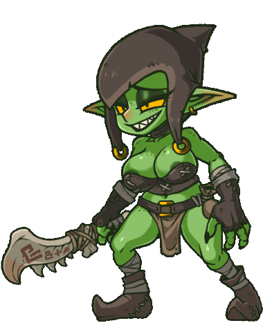

<h1 align="center"><code>👺</code> Goblin</h1>

<div align="center">
    
</div>

## `📖` About

**Goblin** is a command-line tool that helps you to generate and reverse **Jenkins** pipelines.

## `📦` Installation

### `🐀` Go

```bash
go get -u github.com/PunGrumpy/goblin
```

### `🍺` Homebrew

```bash
brew tap PunGrumpy/formulas
brew install goblin
```

## `📝` Usage

```bash
goblin [command]
```

## `📚` Commands

| 💬 Command |      📖 Description      |
| :--------: | :----------------------: |
|   `hash`   |  Hash the given string   |
| `reverse`  | Reverse the given string |

### `hash`

```bash
goblin hash [string]
```

> **Note**: This command `hash` the provided string and displays the `hexadecimal`, `decimal` and `binary` values.

### `reverse`

```bash
goblin reverse --target [target] --length [length] [--characters [characters]]
```

> **Note**: This command `reverse` the given hash and find all possible pre-images of the specified length.

## `🖥️` Examples

### `hash`

```bash
goblin hash "Hello World"
[*] Jenkins' one time hash for "Hello World":
[+] Hexadecimal: 0xBA5A14
[+] Decimal: 12212756
[+] Binary: 101110100101101000010100
```

### `reverse`

```bash
goblin reverse --target 123456 --length 4
[*] Possible pre-images of length 4 for hash 123456:
[+] - abc1
[+] - def2
[+] - ghi3
```

## `📜` License

This project is licensed under the MIT License - see the [LICENSE](LICENSE) file for details.
